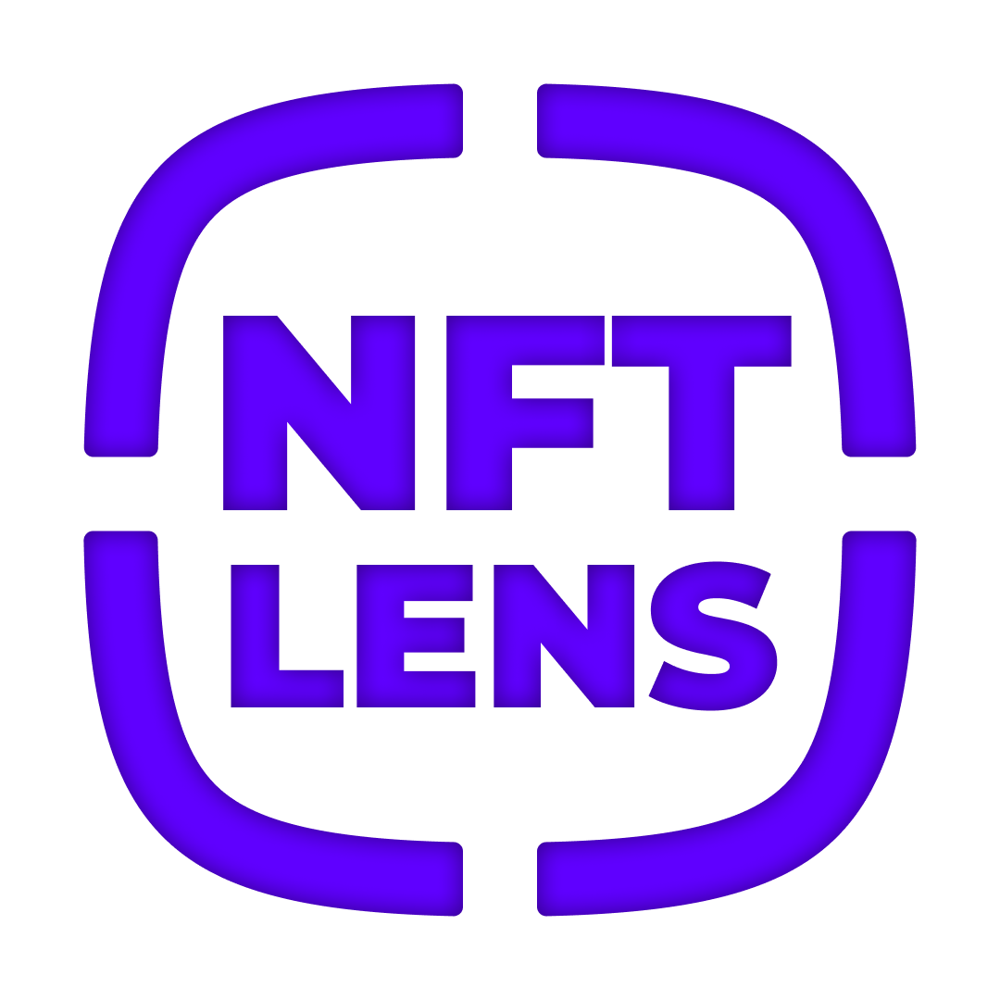

# NFT Lens (Open InfoEducatie 2022)
NFT Lens is a simple Web App that helps you visualize NFTs of a specific Wallet Address.

## Sequence Diagram
The app uses the `NFT API` from [Moralis](https://moralis.io) to gather `metadata` from a variety of Blockchain Networks:
- Ethereum (ETH)
- Binance Smart Chain (BSC)
- Polygon (MATIC)
- Avalanche (AVAX)
- Fantom (FTM)
- **Testnets are fully supported by the NFT API**

## Login with your own Wallet
To be able to use this app, you need to connect your [MetaMask Wallet](https://metamask.io/).

**Disclaimer: The app is tested only on desktop browsers**

**Disclaimer: You need to have the [MetaMask Extension](https://metamask.io/download/) installed in your browser**

# ✅ Features
- Connect with MetaMask
- Search NFTs by Wallet Address
- Simple search history

# 🔜 Future Improvements
- Being able so save Addresses
- Bigger preview for NFTs
- Implementation with Docker
- Automated deployment using Github Action
